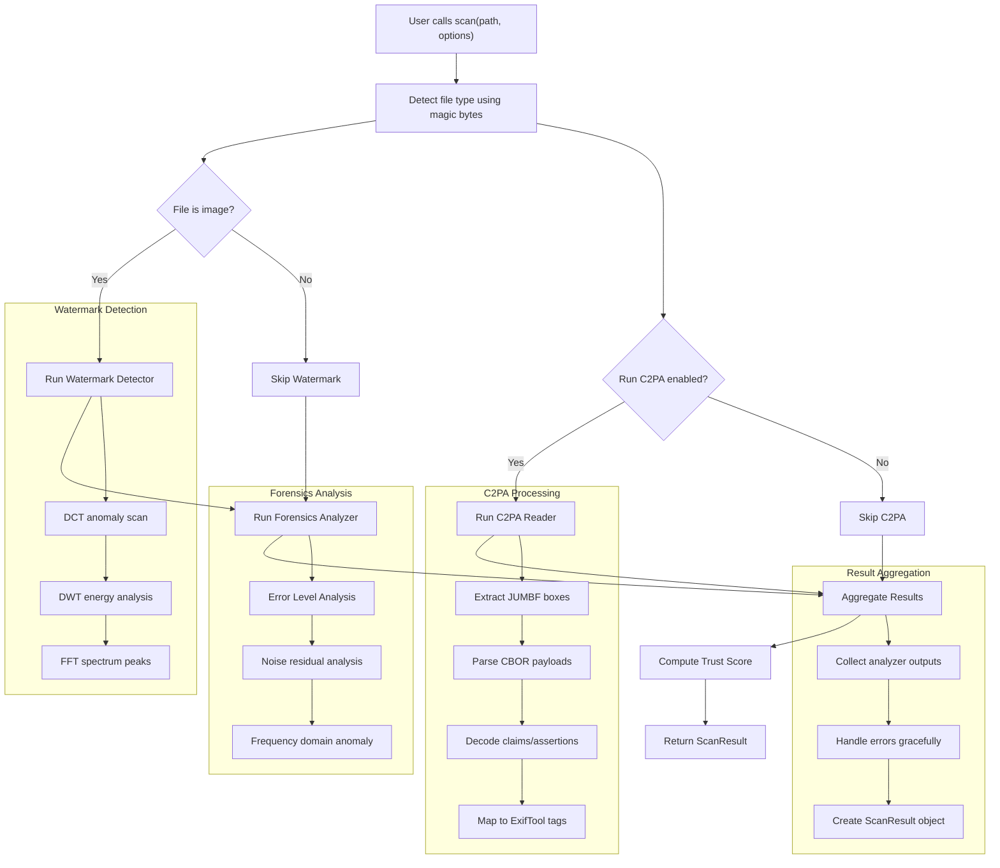

# authentica 🔍

**AI content authenticity detection for Python.**  
Detect C2PA content credentials, invisible watermarks, and image forensics anomalies — all in one `pip install`.

Inspired by [ExifTool](https://exiftool.org)'s philosophy: **never trust the extension, always read the bytes**.

[](https://pypi.org/project/authentica/)
[](https://python.org)
[](LICENSE)

---

## What it does

| Capability | What is detected | How |
|---|---|---|
| **C2PA / Content Credentials** | Manifest presence, COSE signature validity, all assertions (creator, AI gen, training rights, actions) | JUMBF box parsing + CBOR decoding of JPEG APP11 / PNG iTXt chunks |
| **Passive watermark detection** | Invisible frequency-domain watermarks (DWT, DCT, FFT-peak analysis) | Blind detection — no original image needed |
| **Image forensics** | ELA inconsistency, camera noise anomalies, GAN/diffusion grid artifacts | Error Level Analysis + noise residual + FFT cross-peak detection |
| **Heatmap output** | Visual per-pixel influence maps | numpy + matplotlib |

---

## Install

```bash
pip install authentica
```

For full heatmap support:
```bash
pip install "authentica[docs]"
```

---

## Quick start

### Python API

```python
from authentica import scan

result = scan("photo.jpg")
print(result.summary())
# [photo.jpg]  type=image/jpeg  trust=72/100  c2pa=✓  watermark=✗

# C2PA manifest
if result.has_c2pa:
    for assertion in result.c2pa.assertions:
        print(assertion.label, "—", assertion.description)

# Watermark heatmap
if result.has_watermark:
    result.watermark.save_heatmap("watermark_heatmap.png")

# Forensics heatmap
result.forensics.save_ela_heatmap("ela.png")

# Full JSON output
import json
print(json.dumps(result.to_dict(), indent=2))
```

### Individual analyzers

```python
from authentica.c2pa import C2PAReader
from authentica.watermark import WatermarkDetector
from authentica.forensics import ForensicsAnalyzer

# C2PA only
c2pa = C2PAReader().read("photo.jpg")
print(c2pa.claim_generator)   # e.g. "Adobe Photoshop 25.0"
print(c2pa.signature_valid)   # True / False

# Watermark only
wm = WatermarkDetector().detect("photo.jpg")
print(f"Watermark: {wm.detected}  confidence: {wm.confidence:.0%}")
wm.save_heatmap("wm.png")

# Forensics only
forensics = ForensicsAnalyzer().analyze("photo.jpg")
print(f"Anomaly score: {forensics.anomaly_score:.0%}")
forensics.save_ela_heatmap("ela.png")
forensics.save_noise_heatmap("noise.png")
```

### CLI

```bash
# Full scan
authentica scan photo.jpg

# Full scan with JSON output
authentica scan photo.jpg --json

# Scan and save watermark heatmap
authentica scan photo.jpg --heatmap wm.png

# C2PA only
authentica c2pa photo.jpg

# Watermark only, save heatmap
authentica watermark photo.jpg --save-heatmap wm.png

# Forensics only, save both heatmaps
authentica forensics photo.jpg --save-ela ela.png --save-noise noise.png
```

---

## Architecture

```
authentica/
├── core.py                   # scan() — unifies all analyzers
├── c2pa/
│   └── reader.py             # JUMBF/CBOR C2PA manifest parser
├── watermark/
│   └── detector.py           # DCT + DWT + FFT watermark detection
├── forensics/
│   └── analyzer.py           # ELA + noise residual + frequency forensics
├── utils/
│   └── file_type.py          # Magic-byte file type detection
└── cli/
    └── main.py               # Rich CLI (Click + Rich)
```

### Data Flow



The main flow follows this pattern:
1. **File type detection** using magic bytes (never trusts extensions)
2. **Conditional analyzer execution** based on file type and user options
3. **Result aggregation** into a unified `ScanResult` with trust scoring
4. **Error handling** that gracefully degrades when individual analyzers fail

### How it compares to ExifTool

| ExifTool (Perl) | Authentica (Python) |
|---|---|
| Reads metadata from any file via magic bytes | Same — detects file type from bytes, never extension |
| Walks binary container formats (EXIF, XMP, IPTC) | Walks JUMBF boxes, decodes CBOR C2PA structures |
| Outputs structured key-value metadata | Outputs structured Python dataclasses + JSON |
| CLI: `exiftool photo.jpg` | CLI: `authentica scan photo.jpg` |
| 50k lines of Perl | Pure Python, typed, tested |

### C2PA manifest parsing — how it works

C2PA stores a **manifest store** as a JUMBF (ISO 19566-5) container:

```
JPEG file
  └── APP11 markers (0xFFEB) — concatenated in sequence order
       └── JUMBF superbox  (TBox='jumb')
            └── JUMBF description box (TBox='jumd', UUID=c2pa UUID)
                 └── CBOR payload — the manifest store
                      ├── active_manifest reference
                      └── manifests map
                           └── claim (CBOR)
                                ├── claim_generator
                                ├── assertions[] — JUMBF URI references
                                └── COSE_Sign1 signature
```

---

## Supported formats

| Format | C2PA | Watermark | Forensics |
|--------|------|-----------|-----------|
| JPEG   | ✓    | ✓         | ✓         |
| PNG    | ✓    | ✓         | ✓         |
| WebP   | —    | ✓         | ✓         |
| TIFF   | —    | ✓         | ✓         |
| PDF    | ✓ (basic) | —    | —         |
| MP4/MOV | planned | —   | —         |

---

## Development

```bash
# Clone and install in dev mode
git clone https://github.com/yourusername/authentica
cd authentica
pip install -e ".[dev]"

# Run tests
pytest

# Lint + format
ruff check src/
ruff format src/
```

---

## Contributing

Contributions welcome! See [CONTRIBUTING.md](CONTRIBUTING.md).

Ideas for future modules:
- `authentica.llm` — LLM-generated text detection (perplexity, KGW watermark)
- `authentica.video` — frame-level C2PA + watermark analysis
- `authentica.synthid` — Google SynthID watermark detection

---

## License

MIT — see [LICENSE](LICENSE).

---

## Acknowledgements

- [C2PA Specification](https://c2pa.org) — Coalition for Content Provenance and Authenticity
- [ExifTool](https://exiftool.org) — Phil Harvey's metadata reader (inspiration for the magic-byte approach)
- [invisible-watermark](https://github.com/ShieldMnt/invisible-watermark) — DCT/DWT watermark methods
- [Content Authenticity Initiative](https://contentauthenticity.org)

---

## v0.2.0 — ExifTool feature parity update

Inspired by studying the ExifTool source (Perl), this release adds full metadata reading and cross-platform support.

### New commands

```bash
# Read all metadata (like: exiftool FILE)
authentica meta photo.jpg
authentica meta photo.jpg --json          # machine-readable JSON
authentica meta photo.jpg --csv           # CSV row
authentica meta photo.jpg --gps-dms      # GPS as deg°min'sec"

# Compare metadata between two files (like: exiftool -diff FILE1 FILE2)
authentica diff original.jpg edited.jpg
authentica diff original.jpg edited.jpg --json

# Batch scan a directory (like: exiftool -r -json DIR)
authentica scan-dir /photos --json
authentica scan-dir /photos --csv --out metadata.csv
authentica scan-dir /photos --ext jpg --ext png --progress

# Extract embedded thumbnail (like: exiftool -ThumbnailImage -b FILE)
authentica thumbnail photo.jpg --out thumb.jpg

# Platform info (like: exiftool -ver -v)
authentica version --verbose
```

### New Python API

```python
from authentica import MetadataReader, diff_metadata, BatchScanner

# Full metadata read — EXIF, IPTC, XMP, GPS, ICC, ID3, QuickTime
meta = MetadataReader().read("photo.jpg")
print(meta.exif["Make"], meta.exif["Model"])
print(meta.gps.coord_format("dms"))         # 41° 53' 32.00" N, 12° 29' 24.00" E
print(meta.composite["Aperture"])           # f/2.8
print(meta.composite["ShutterSpeed"])       # 1/500
print(meta.md5, meta.sha256)               # file integrity hashes

# Metadata diff
diff = diff_metadata("original.jpg", "edited.jpg")
print(diff.summary())
for entry in diff.changed:
    print(f"{entry.tag}: {entry.value_a!r} → {entry.value_b!r}")

# Batch scan
scanner = BatchScanner(extensions={".jpg", ".png"}, recurse=True, progress=True)
for path in scanner.walk("/photos"):
    meta = MetadataReader().read(path)
    print(path.name, meta.gps.coord_format() if meta.gps else "no GPS")
```

### What we took from ExifTool (and improved)

| ExifTool feature | Authentica equivalent |
|---|---|
| `exiftool FILE` — read all metadata | `authentica meta FILE` |
| EXIF: Make, Model, GPS, Aperture, ISO… | `MetadataReader` — full EXIF + composite |
| GPS decimal + deg/min/sec formatting (`-c`) | `gps.coord_format("decimal"/"dms")` |
| IPTC: Creator, Keywords, Caption | Parsed from APP13 IRB |
| XMP: Dublin Core, photoshop:, xmpRights: | Parsed from APP1/iTXt |
| ID3 tags (MP3) | `meta.id3["Title"]`, `["Artist"]`… |
| QuickTime/MP4 atoms | `meta.quicktime["Title"]`… |
| ICC color profile | `meta.icc["ProfileDescription"]` |
| MD5Sum, SHA256Sum composite tags | `meta.md5`, `meta.sha256` |
| Composite: Aperture, ShutterSpeed, LV | `meta.composite["Aperture"]` etc. |
| `exiftool -diff FILE1 FILE2` | `diff_metadata(a, b)` |
| `exiftool -r -ext jpg DIR` | `BatchScanner(extensions={".jpg"}, recurse=True)` |
| `exiftool -csv DIR` | `results_to_csv(results)` |
| `exiftool -ThumbnailImage -b FILE` | `extract_thumbnail(file)` |
| Cross-platform (Perl+DLLs on Windows) | Pure Python — works on Linux/macOS/Windows |
| `-ver -v` platform info | `authentica version --verbose` |
